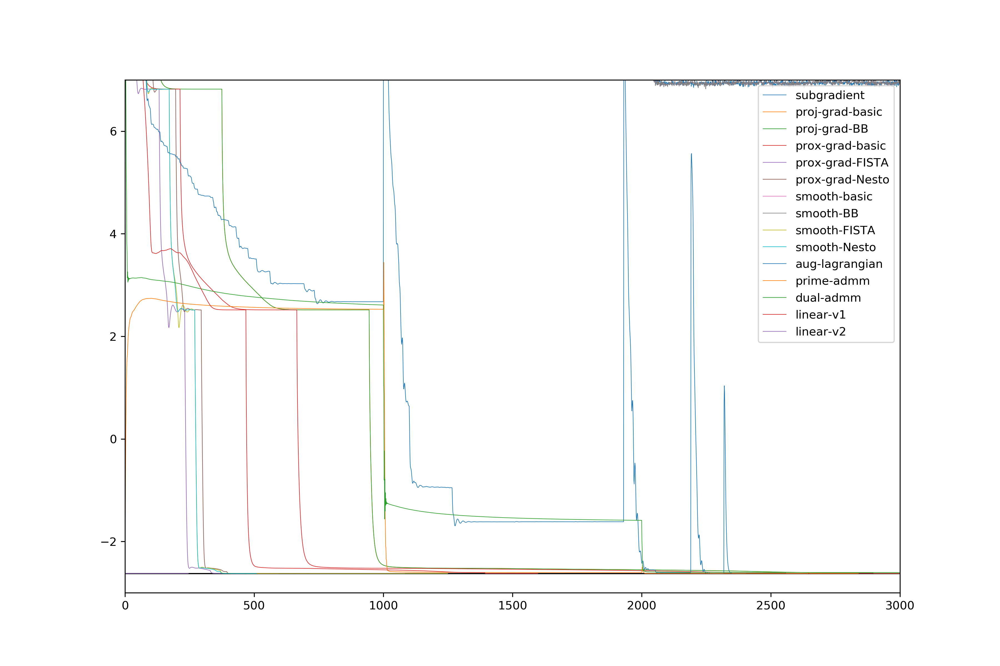
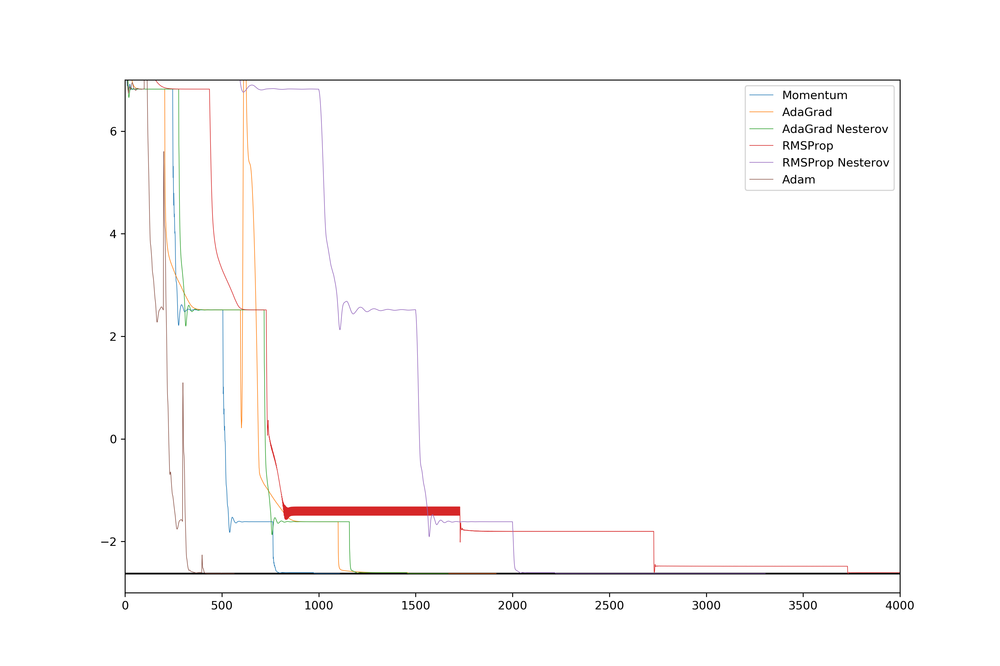

# The problem
Lasso (least absolute shrinkage and selection operator; also Lasso or LASSO) is a a regression analysis method that performs both variable selection and regularization in order to enhance the prediction accuracy and interpretability of the statistical model it produces. This repository contains various convex optimizers for it, including subgradient methods, project gradient, proximal gradient methods, smooth method, lagrangian methods and stochastic gradient descent variants.

Mathematically speaking, the problem is formed as
$$\begin{equation}
min_{x} \ \frac{1}{2}\| Ax-b\|^2 + \mu \|x\|_1
\end{equation}$$
where $A \in \mathbb{R}^{m \times n}$ and $b \in \mathbb{R}^{n}$ are given data matrix.

## The Results
Common Convex Optimizers:

Stochastic Gradient Descent Variants:
